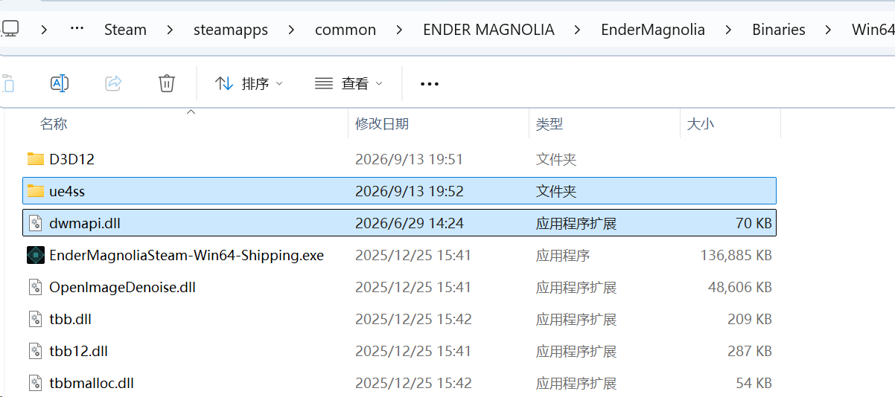
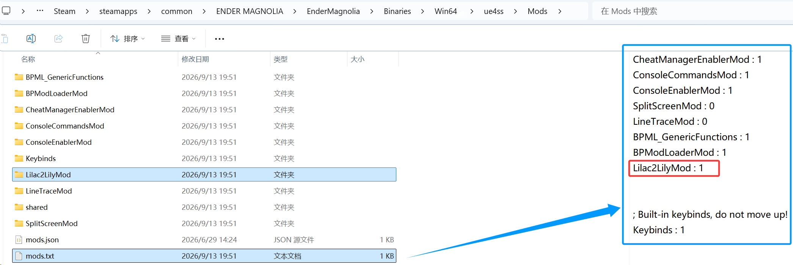
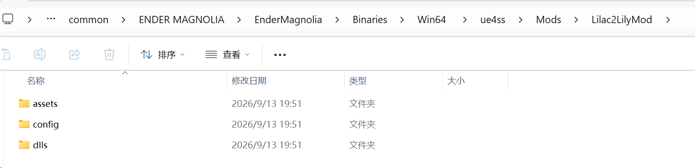

[English](README.md) | [简体中文](README.zh-CN.md)

# Lilac2LilyMod

A skin expansion mod for *ENDER MAGNOLIA*. It adds **Garment of Bygone Days** as a new costume for Lilac, giving her Lily's appearance.

This is a visual skin expansion only: the character's gameplay logic and identity remain Lilac. After installation, open the menu at a rest point, select **Extra**, and scroll to the bottom of the costume list to find the new costume.

## Mod Installation Environment Requirements

- Operating system: Windows 10/11
- CPU architecture: amd64
- Game version: 1.1.1
- UE4SS version: [UE4SS v3.0.1-998-g32d8a381](https://github.com/UE4SS-RE/RE-UE4SS/releases/download/experimental/UE4SS_v3.0.1-998-g32d8a381.zip)

## Preview


## Installation

### 1. Install UE4SS

Download the UE4SS package used by this Mod:

[UE4SS v3.0.1-998-g32d8a381](https://github.com/UE4SS-RE/RE-UE4SS/releases/download/experimental/UE4SS_v3.0.1-998-g32d8a381.zip)

Extract it into the game's `Binaries/Win64` directory. After extraction, the directory should look similar to:

```text
.../Steam/steamapps/common/ENDER MAGNOLIA/EnderMagnolia/Binaries/Win64/
├── ...                  # existing files
├── ue4ss/
└── dwmapi.dll
```

### 2. Install Lilac2LilyMod

Download the `Lilac2LilyMod` archive from this repository's **Releases** page.
Extract it and place the first-level `Lilac2LilyMod` directory into:

```text
.../Steam/steamapps/common/ENDER MAGNOLIA/EnderMagnolia/Binaries/Win64/ue4ss/Mods/
```

The final layout should look similar to:

```text
.../Steam/steamapps/common/ENDER MAGNOLIA/EnderMagnolia/Binaries/Win64/
├── ...                  # existing files
├── ue4ss/
│   ├── Mods/
│   │   ├── ...          # other mods
│   │   ├── Lilac2LilyMod/
│   │   │   ├── config/
│   │   │   ├── assets/
│   │   │   └── dlls/
│   │   │       └── main.dll
│   │   └── mods.txt
│   └── ...              # other UE4SS files
└── dwmapi.dll
```

Then open `ue4ss/Mods/mods.txt` and add or enable this line:

```text
Lilac2LilyMod : 1
```

Place the line with the other Mod entries, before the built-in `Keybinds` entry if one is present.

### 3. Installed Directory Structure

After installation, the directory structure and configuration should look like this:







## Clone and build

This section is only needed if you want to build the Mod from source. Users installing a release archive can skip it.

Clone this repository with its nested UE4SS submodules:

```powershell
git clone --recurse-submodules https://github.com/f14XuanLv/Lilac2LilyMod
cd Lilac2LilyMod
```

If the repository was cloned without `--recurse-submodules`, initialize the submodules from the repository root:

```powershell
git submodule update --init --recursive
```

Requirements:

- Windows x64
- Visual Studio 2022 with MSVC 14.44 or newer
- Ninja
- CMake 3.22 or newer
- Git

Build with:

```bat
build.bat
```

Use `build.bat clean` for a clean build. The default configuration is `Game__Shipping__Win64`.
The generated Mod package is placed at:

```text
build/Game__Shipping__Win64/Lilac2LilyMod/
├── config/
├── assets/
└── dlls/
    └── main.dll
```
