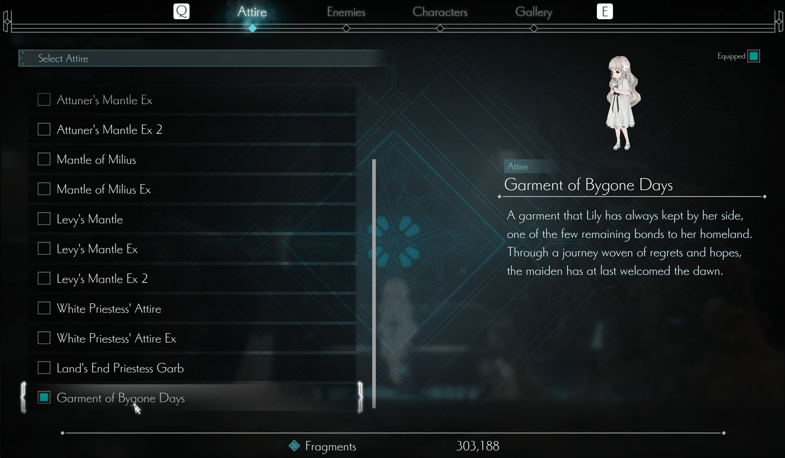

[English](README.md) | [简体中文](README.zh-CN.md)

# Lilac2LilyMod

一个服务于《ENDER MAGNOLIA》的拓展皮肤 Mod，为莱拉克（Lilac）新增服装
**往昔记忆的衣裳（Garment of Bygone Days）**，让莱拉克拥有莉莉的外观。

这只是外观皮肤拓展，角色逻辑和游戏中的角色本质仍然是莱拉克（Lilac）。安装完成后，进入休息点打开菜单，点击 **Extra（额外内容）**，将服装列表滑动到最下方，即可看到新增服装。

## 效果预览




## 安装教程

### 1. 安装 UE4SS

下载本 Mod 使用的 UE4SS：

[UE4SS v3.0.1-998-g32d8a381](https://github.com/UE4SS-RE/RE-UE4SS/releases/download/experimental/UE4SS_v3.0.1-998-g32d8a381.zip)

将其解压到游戏的 `Binaries/Win64` 目录。解压后，目录结构应类似于：

```text
.../Steam/steamapps/common/ENDER MAGNOLIA/EnderMagnolia/Binaries/Win64/
├── ...                  # 已有文件
├── ue4ss/
└── dwmapi.dll
```

### 2. 安装 Lilac2LilyMod

从本仓库的 **Releases** 页面下载 `Lilac2LilyMod` 压缩包。
将其解压，并把第一层的 `Lilac2LilyMod` 目录放入：

```text
.../Steam/steamapps/common/ENDER MAGNOLIA/EnderMagnolia/Binaries/Win64/ue4ss/Mods/
```

最终目录结构应类似于：

```text
.../Steam/steamapps/common/ENDER MAGNOLIA/EnderMagnolia/Binaries/Win64/
├── ...                  # 已有文件
├── ue4ss/
│   ├── Mods/
│   │   ├── ...          # 其他 Mod
│   │   ├── Lilac2LilyMod/
│   │   │   ├── config/
│   │   │   ├── assets/
│   │   │   └── dlls/
│   │   │       └── main.dll
│   │   └── mods.txt
│   └── ...              # 其他 UE4SS 文件
└── dwmapi.dll
```

然后打开 `ue4ss/Mods/mods.txt`，添加或启用以下行：

```text
Lilac2LilyMod : 1
```

如果存在内置的 `Keybinds` 条目，请将本 Mod 放在该条目之前。

## 克隆和编译

如果你只是安装 Releases 中的 Mod 压缩包，可以跳过本节。本节仅适用于希望从源码构建 Mod 的用户。

使用以下命令克隆包含嵌套 UE4SS 子模块的仓库：

```powershell
git clone --recurse-submodules <Lilac2LilyMod-repository-url>
cd Lilac2LilyMod
```

如果克隆仓库时未使用 `--recurse-submodules`，请从仓库根目录初始化子模块：

```powershell
git submodule update --init --recursive
```

依赖环境：

- Windows x64
- Visual Studio 2022，MSVC 14.44 或更高版本
- Ninja
- CMake 3.22 或更高版本
- Git

执行以下命令编译：

```bat
build.bat
```

使用 `build.bat clean` 可执行完整清理后再编译。默认配置为 `Game__Shipping__Win64`。
编译产物会生成在：

```text
build/Game__Shipping__Win64/Lilac2LilyMod/
├── config/
├── assets/
└── dlls/
    └── main.dll
```
